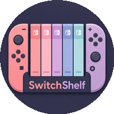
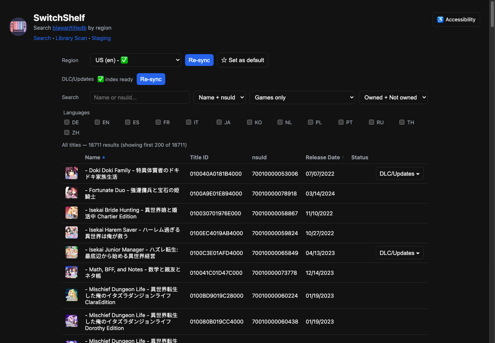
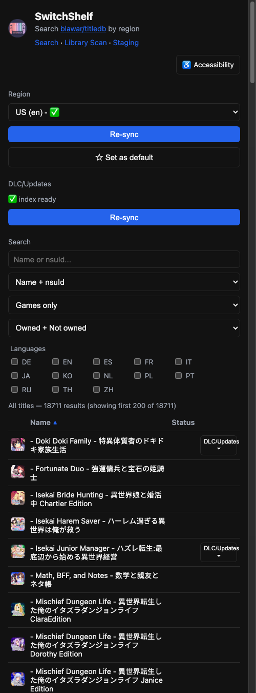
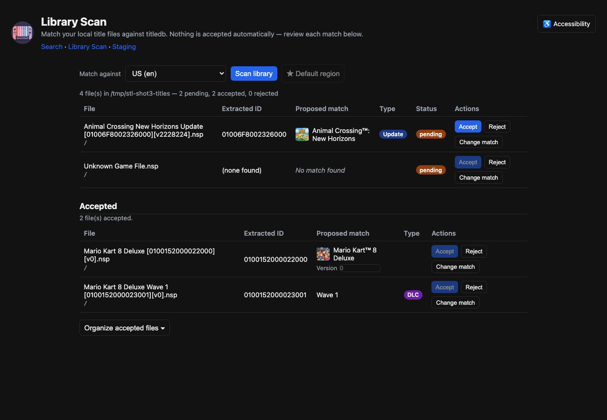

# SwitchShelf

A self-hosted web app for browsing [blawar/titledb](https://github.com/blawar/titledb) by region, and for matching a local Nintendo Switch title library against it.

> **Note:** This is a personal-use project, built because I couldn't find an existing tool that did exactly what I wanted. It was built with heavy use of AI assistance and reviewed personally by me, but it has not been professionally audited. **Use at your own risk** — especially the Library Scan "Organize" feature and the Staging page, both of which rename and move files on your filesystem.

## What it does

- Syncs region catalog files (and the DLC/update metadata file) from `blawar/titledb` on demand, only downloading what you select.
- Search/browse titles by name or nsuId, sortable by Name or Release Date (click a column header — clicking again flips direction), with filters for content type (games vs. DLC/updates/demos), language, and ownership. Switch 2 titles are excluded entirely — there's currently no way to dump/back up a Switch 2 game, so they're not relevant to what this app does.
- Per-title details page: full metadata, screenshots, matched demos, and related DLC/updates — including versions you've matched locally that titledb doesn't catalog yet.
- **Library Scan**: point the app at a local folder of `.nsp`/`.nsz`/`.xci`/`.xcz` files, match each one against titledb by the title ID in its filename, and manually accept/reject/override each match — including matching a file directly to its DLC or update-edition catalog entry, and setting/correcting a file's version by hand when its filename doesn't carry one. Accepted files move into their own table, separate from what still needs review.
- **Organize**: for accepted matches, preview and optionally apply a rename/move into `<Title> [<TitleId>]/` folders with cleaned-up filenames (`<Title> [<TitleId>][v<version>]` for base games/updates).
- **Staging** (opt-in, off by default): a separate drop-off folder for new files. Scan and match it exactly like Library Scan, then accepted files are moved (renamed the same way as Organize) out of Staging and into the main Library, rather than being reorganized in place.
- Accessibility options (top-right of every page): high contrast, larger text, reduced motion, and always-underlined links — persisted locally and applied instantly.

## Screenshots

The main search page — region/DLC sync controls, name/nsuId search, content-type/ownership/language filters, and results:



Same page on mobile:



Library Scan — matched files with type badges (DLC/Update), a version editor, and accepted files split into their own table:



## Requirements

- Docker and Docker Compose

## Setup

1. Copy the env file and point it at your title library (optional — only needed for Library Scan and Staging):
   ```sh
   cp .env.example .env
   # edit .env and set TITLES_HOST_DIR to your local folder,
   # and STAGING_ENABLED=true + STAGING_HOST_DIR if you want the Staging page
   ```
   Staging is off by default — its nav link/page are hidden and its API routes
   return 404 until you set `STAGING_ENABLED=true`.
2. Build and start:
   ```sh
   docker compose up -d --build
   ```
3. Open `http://localhost:3000`.

Both folders are mounted **read-write**, since Organize and Staging need to rename/move files in place. If you don't want that, don't use those features, or point `TITLES_HOST_DIR`/`STAGING_HOST_DIR` at copies instead of your originals.

## Project layout

- `server.js` — Express app and API routes.
- `lib/` — sync (titledb downloads), store (search/filtering/ownership), scanner (local file matching, both the Library and Staging folders), decisions (accept/reject state, namespaced per source), organize (rename/move planning, both in-place and Staging → Library), cnmts (DLC/update relationships), expand (merges cnmts relations with locally-matched versions for the DLC/Updates list).
- `public/` — static frontend (search page, details page, library scan page, staging page — the latter two share `scan-core.js`).
- `data/` — downloaded titledb files and app state (gitignored, persisted in a Docker volume).
- `test/` — unit tests for the `lib/` modules (Node's built-in test runner, no extra dependencies).

## Tests

```sh
npm test
```

Runs the `lib/` unit tests (sync, store, cnmts, decisions, scanner, organize, staging, expand) with `node --test`. Each test file uses an isolated temp directory, so nothing touches your real `data/` or title library. Network calls in the sync tests are mocked — no real requests to GitHub are made.

## Disclaimer

This tool does not host, distribute, or provide any game files. It only reads metadata from the public `blawar/titledb` repository and matches it against filenames already present in a folder you point it at. You are responsible for the legality of any files in that folder.
